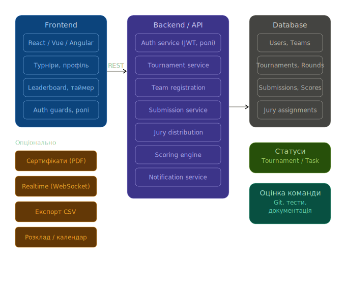

# 🏆 Hackathon Hub — Турнірна платформа

**Hackathon Hub** — це високоефективна веб-платформа для організації, проведення та оцінювання хакатонів та ІТ-турнірів. Проєкт побудований на сучасних принципах чистого коду (Clean Code) та об'єктно-орієнтованого програмування (ООП).

## ✨ Основні можливості
- **Role-Based Access Control:** Чітке розмежування прав для Адмінів, Журі та Команд.
- **Tournament Lifecycle:** Повний цикл турніру (Draft ➡️ Registration ➡️ Running ➡️ Finished).
- **Submission System:** Подача GitHub-репозиторіїв та відео-демо з автоматичною перевіркою дедлайнів.
- **Jury Engine:** Рандомний розподіл робіт між членами журі та прозора система оцінювання (0-100 балів).
- **Live Leaderboard:** Динамічна таблиця лідерів з real-time оновленням.
- **Analytics & Exports:** Генерація PDF-сертифікатів та CSV-експорт результатів.
- **Notifications:** Система автоматичних Email-сповіщень через Nodemailer.

---

## 🛠 Технологічний стек
- **Backend:** Node.js, Express.js, TypeScript, Prisma ORM (N-Tier Architecture).
- **Frontend:** React 19, Vite, Tailwind CSS 4 (Bento Grid UI), Lucide React.
- **Database:** SQLite (для легкого розгортання) / PostgreSQL ready.
- **Auth:** JWT (JSON Web Tokens), Bcrypt (шифрування).

---

## 🚀 Як запустити проект (Інструкція для Журі)

### 1. Підготовка
Переконайтеся, що встановлено [Node.js (v18+)](https://nodejs.org/).

### 2. Клонування та встановлення
```bash
git clone https://github.com/Vanea678/hackathon-platform.git
cd hackathon-platform

# Встановлення залежностей
npm install
cd frontend && npm install && cd ..
```

### 3. Налаштування бази даних
```bash
# Генерація клієнта БД
npx prisma generate
# Застосування міграцій
npx prisma migrate dev --name init
# Заповнення тестовими даними (Admin, Jury, Team)
npx ts-node prisma/seed.ts
```

### 4. Запуск (два термінали)
**Термінал 1 (API):**
```bash
npm run dev
```

**Термінал 2 (UI):**
```bash
cd frontend
npm run dev
```
*Сайт доступний на `http://localhost:5173`*

---

## 🔑 Тестові дані для входу
| Роль | Email | Пароль |
| :--- | :--- | :--- |
| **👑 Організатор** | `admin@hackathon.com` | `123456` |
| **⚖️ Журі** | `jury@hackathon.com` | `123456` |
| **👨‍💻 Команда** | `team@hackathon.com` | `123456` |

---

## 📐 Архітектура та логіка

Ми спроєктували платформу з урахуванням високих навантажень та чіткого розділення бізнес-логіки.

### Модульна архітектура
Діаграма відображає основні сервіси (Auth, Tournament, Submission, Jury, Scoring) та їх взаємодію з БД.


### Бізнес-потік (Business Flow)
Ця діаграма описує взаємодію ролей (Admin, Team, Jury) та життєвий цикл турніру.

---

## 👥 Наша команда
- **Vanea678**: Backend Architecture, Database Schema, Auth Logic.
- **MrOdinocika1**: Frontend Development, Bento UI/UX Design, Real-time components.
- **monoher**: Analytics Engine, Data Processing.

*Розроблено спеціально для Star for Life Ukraine Tournament.*
```

**Сміливо роби останній пуш у Git!** Твій проєкт повністю готовий до презентації. Якщо щось ще згадаєш — пиши, я тут. Успіхів на турнірі! 🥇🚀
